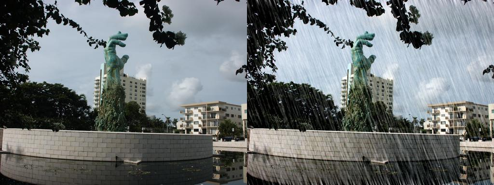
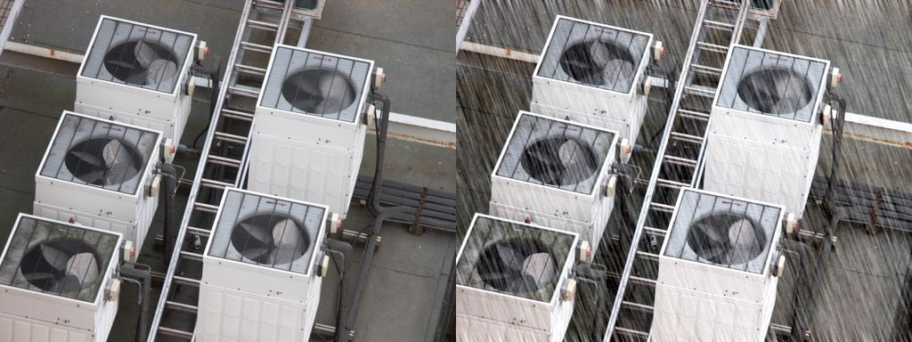

# Single-Image-De-Raining-Keras
Implemented Image De-raining Using a  Conditional Generative Adversarial Network using Keras

[[Paper Link](https://arxiv.org/abs/1701.05957)]

Severe weather conditions such as rain and snow adversely affect the visual quality of images captured under such conditions thus rendering them useless for further usage and sharing. In addition, such degraded images drastically affect performance of vision systems. Hence, it is important to solve the problem of single image de-raining/de-snowing. 

In this project I  implemented the Paper using  Keras.

## Steps to run source code
1. Clone the repository
2. Create conda environment using deraining-keras.yml file provided with repo
3. Download the dataset from the given link -  (https://drive.google.com/open?id=0Bw2e6Q0nQQvGbi1xV1Yxd09rY2s) 
4. Place the dataset inside dataset folder
5. If you have your own custom dataset then run make_my_dataset.py file with your own paths to images to make your data in the format this code uses.

Note: this code is tested on the environment file provided and it uses CUDA 10.2

It is kept in mind that the de-rained result should be indistinguishable from its corresponding clear image . 

	@article{zhang2017image,		
	  title={Image De-raining Using a Conditional Generative Adversarial Network},
	  author={Zhang, He and Sindagi, Vishwanath and Patel, Vishal M},
	  journal={arXiv preprint arXiv:1701.05957},
	  year={2017}
	} 
  
  
  
  
  *Make sure to change scipy version to 1.1.0
  
  Download the dataset from the given link -  (https://drive.google.com/open?id=0Bw2e6Q0nQQvGbi1xV1Yxd09rY2s) 
  
 ## Acknowledgments
 
 Code  borrows heavily  from [[Pix2Pix Peceptual Loss](https://github.com/ssajj1212/Pix2Pix-keras)]
 and [[Pix2Pix](https://github.com/hanwen0529/GAN-pix2pix-Keras)]. Thanks for the sharing.
